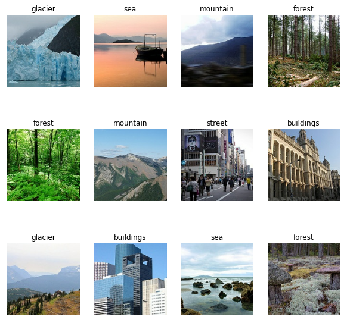
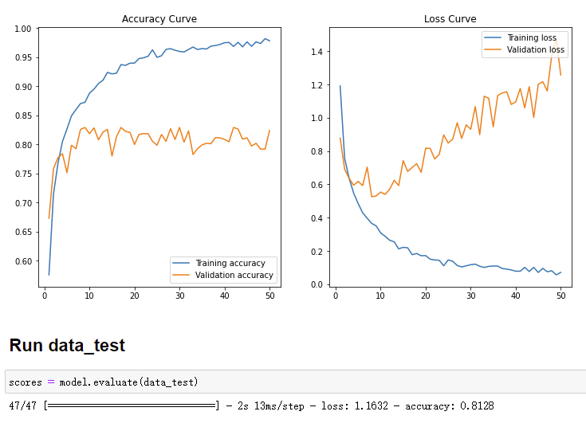

# Image Classification by CNN

This is an image classification problem of around 25k pictures, to be classified into 6 categories. {'buildings' -> 0, 'forest' -> 1, 'glacier' -> 2, 'mountain' -> 3, 'sea' -> 4, 'street' -> 5 }. The pictures are of size 150 x 150. Shown below is 12 sample pictures randomly selected from the datasets. The origial data can be found at: https://www.kaggle.com/puneet6060/intel-image-classification

In the pre-processing step, Tensorflow input pipeline is utilized to do the following:
1. To read in the data as TF datasets.
2. To put the training images into batches of size = 32.
3. To divide the rest dataset into validation set and test set.
4. To attach labels to the corresponding images.

Furthermore, in order to expedite the training step, we also used cache() to save the data load time for each epoch and used prefetch() to better coordicate the CPU and GPU. In particular, these can be done by the pre-set tensorflow methods.

As a result, the accuracy curve and the loss curve are shown below. The prediction accuracy for the test set is around 81%.

Tensorflow input pipeline is used in data preprocessing to accelerate this step. The classifier is trained by CNN.

